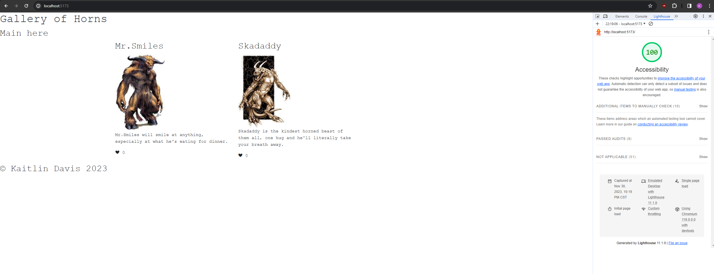

# React + Vite

This template provides a minimal setup to get React working in Vite with HMR and some ESLint rules.

Currently, two official plugins are available:

- [@vitejs/plugin-react](https://github.com/vitejs/vite-plugin-react/blob/main/packages/plugin-react/README.md) uses [Babel](https://babeljs.io/) for Fast Refresh
- [@vitejs/plugin-react-swc](https://github.com/vitejs/vite-plugin-react-swc) uses [SWC](https://swc.rs/) for Fast Refresh

## Author

Kaitlin Davis || November 2023

## Norned Beast

This is a lab done during Code 301 at Code Fellows

## Time Estimate

Number and name of feature: Feature #1: Display a Modal

Estimate of time needed to complete: 3 hour

Start time: 12:00am

Finish time:10:00pm 

Actual time needed to complete: 7 hours (on and off)

## Images

### Lighthouse Score

## Resources

JB Tellez

ChatGPT
